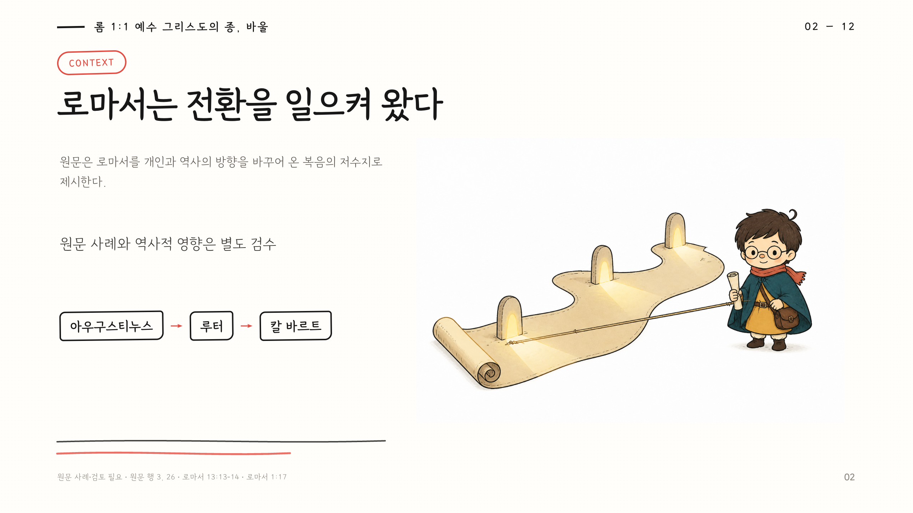

# Handdrawn Longform HTML



긴 분량의 한글/영문 글(설교, 에세이, 칼럼, 강연 등)의 구조와 논지를 분석하여, 일상적이고 친근한 손그림 캐릭터 중심의 슬라이드로 구성하고 정적 **HTML** 및 인쇄용 **PDF** 덱으로 렌더링하는 에이전트 스킬 엔진입니다.

## 지침 계층 구조

[`SKILL.md`](SKILL.md)는 워크플로우 실행 입구(Entry Point)입니다. [`references/`](references/) 디렉터리 하위의 문서들은 세부 처리 프로세스 및 품질 검수 참조용 지침입니다:

- `editorial-analysis.md` — 주제문 및 논지/주장 그래프 모델링 지침
- `outline-schema.md` — 슬라이드 아웃라인 및 `deck.json` 스키마 규격
- `rendering.md` — HTML/PDF 렌더링 기능 및 레이아웃 사전 검증(Preflight) 수칙
- `source-and-citation.md` — 근거, 출처 및 인용 구분 수칙
- `character-continuity.md` — 캐릭터 앵커 및 장면 일관성 지침
- `image-generation.md` — 공급자 비종속 이미지 생성 어댑터 계약
- `genre-adapters.md` — 설교, 에세이, 칼럼, 강의 등 장르별 변환 어댑터
- `review-checklist.md` — 최종 검수 수칙 및 자체 평가 관문

하위 참조 문서들은 독립된 스킬로 실행되지 않으며, [`SKILL.md`](SKILL.md)에 정의된 워크플로우에 따라 필요한 시점에 순차적으로 참조됩니다.

## 간단 사용법 (Usage)

이 스킬은 AI 에이전트 대화창에서 스킬 이름과 **작업 대상 문서**, 그리고 선택 사항인 **캐릭터 참고 이미지**를 지정하여 실행합니다.

### 1. 사용 프롬프트 형태

```text
/handdrawn-longform-html [작업 대상 마크다운 파일] [캐릭터 참고 이미지(선택)]
```

### 2. 사용 예시

- **캐릭터 참고 이미지가 있는 경우**:
  ```text
  /handdrawn-longform-html my-sermon.md my-character.png
  ```

- **캐릭터 참고 이미지가 없는 경우**:
  ```text
  /handdrawn-longform-html my-sermon.md
  ```

> 💡 **캐릭터 자동 생성 안내**: 참고 이미지가 없으면 자산 계획 단계에서 원문 분석·아웃라인을 바탕으로 허구의 관찰자 캐릭터 앵커 생성 작업을 자동으로 만듭니다. 실제 이미지 생성은 호스트 이미지 도구 또는 설정된 이미지 어댑터가 담당합니다.

---

## 고급 파이프라인 명령 (CLI Commands)

수동으로 파이프라인을 검증하거나 개발자 환경에서 직접 빌드할 때 사용하는 명령입니다:

1. **원문 구조 추출**:
   ```sh
   python3 scripts/extract_markdown.py source.md -o output/<slug>/source-analysis.json
   ```

2. **슬라이드 사전 검증 및 빌드**:
   ```sh
   python3 scripts/validate_outline.py output/<slug>/deck.json
   python3 scripts/build_deck.py output/<slug>/deck.json \
     -o output/<slug>/<slug> --make-transparent --targets html,pdf
   ```

   `--make-transparent`는 덱에서 실제로 참조하는 `illustrations/` 이미지만
   명시적으로 제자리 변환합니다. 앵커, 임시 스크린샷, 다른 파일은 건드리지
   않습니다.

3. **브라우저 뷰어 단축키**:
   생성된 HTML 슬라이드 뷰어에서 다음 단축키를 사용할 수 있습니다:
   - `←` / `→` 또는 `PageUp` / `PageDown`: 슬라이드 이전 / 다음 이동
   - `N`: 발표자 스피커 노트 패널 토글
   - `P`: 인쇄 대화상자 호출

### 이미지 자산 자동 생성

이미지 생성은 렌더러와 분리된 공급자 비종속 파이프라인으로 실행합니다.
Imagen, Nano Banana 등은 `handdrawn-image/v1` JSON 어댑터로 연결하며, 코어
파이프라인은 특정 모델명이나 API SDK를 직접 호출하지 않습니다.

```sh
# 검수된 deck.json에서 캐릭터·장면 작업을 계획
npm run assets:plan -- output/<slug>/deck.json

# 외부 어댑터 실행 파일로 자동 생성
npm run assets:generate -- output/<slug>/asset-plan.json \
  --adapter /path/to/handdrawn-image-adapter

# 호스트 내장 이미지 도구가 만든 파일을 작업에 반영
npm run assets:accept -- output/<slug>/asset-plan.json \
  character-anchor /path/to/anchor.png

npm run assets:status -- output/<slug>/asset-plan.json
```

앵커가 없는 경우 `character/anchor.png` 생성 작업이 먼저 실행되고, 그
앵커가 모든 장면에 직접 참조로 전달됩니다. 이전 장면 이미지를 다음 장면의
참조로 연결하지 않습니다. 생성 완료 후에만 `deck.json`이 확정되고 기존
HTML/PDF 빌드가 실행됩니다. 어댑터가 없으면 계획·프롬프트·참조 목록만
남으며 생성 완료로 보고하지 않습니다.

## 실행 명령

Node.js 의존성을 설치합니다:

```sh
npm install
```

전체 기능(투명 배경 변환 및 선택적 PPTX)을 사용하려면 Python 의존성도 설치합니다:

```sh
if [ ! -x .venv/bin/python ]; then python3 -m venv .venv; fi
.venv/bin/python -m pip install -r requirements.txt
```

`.venv`가 로컬 또는 공유 가상환경을 가리키더라도, 이후 Python 명령은
`.venv/bin/python`으로 실행해 동일한 환경을 사용합니다.

경량 파이썬 검사를 실행합니다:

```sh
npm test
python3 scripts/audit_project.py
```

검증을 통과한 덱의 아웃라인을 확인하고 **HTML** 및 **PDF** 결과물을 빌드합니다. `--allow-overwrite` 플래그가 없으면 기존 출력 파일을 덮어쓰지 않습니다.

```sh
python3 scripts/validate_outline.py output/<slug>/deck.json
python3 scripts/build_deck.py output/<slug>/deck.json \
  -o output/<slug>/<slug>-html --targets html,pdf

python3 scripts/audit_project.py --require-output
```

개별 어댑터도 직접 호출할 수 있습니다:

```sh
npm run build:html -- output/<slug>/deck.json -o output/<slug>/<slug>.html
npm run build:pdf -- output/<slug>/<slug>.html -o output/<slug>/<slug>.pdf
```

`pdf` 변환을 위해서는 로컬 Chrome 실행 파일, `pdfinfo`, `pdffonts`가 필요합니다. `font_files`가 선언된 덱은 선언된 로컬 폰트를 정확히 로드해야 하며, PDF 사전 검증 시 페이지 수, 페이지 크기(16:9, 960×540pt), 이미지 로드, 레이아웃 겹침, 내장 폰트 항목이 검사됩니다.

PowerPoint 수정 파일이 필요한 경우, 선택적 호환성 타깃으로 PPTX를 빌드할 수 있습니다:

```sh
python3 scripts/build_deck.py output/<slug>/deck.json \
  -o output/<slug>/<slug> --targets pptx
```

## 공유 패키지

`output/`은 생성물 중복과 대형 바이너리의 Git 유입을 막기 위해 기본적으로
추적하지 않습니다. 완성된 덱을 공유할 때는 canonical HTML, PDF, 앵커,
일러스트레이션, 폰트, 검수 문서를 상대경로로 묶는 패키지 명령을 사용합니다:

```sh
python3 scripts/package_share.py output/<slug> -o share/<slug>
python3 scripts/package_share.py output/<slug> -o share/<slug>.zip
```

패키지에는 하나의 `deck.json`과 하나의 canonical HTML만 포함되며,
`share-manifest.json`이 포함 자산과 상대경로를 기록합니다. 여러 HTML이나
검수 실패 덱이 남아 있으면 패키징이 중단됩니다.

## 산출물 구조 규격

원문 분석(`source-analysis.md`), 논지 그래프(`argument-map.md`), 주장 원장(`claim-ledger.json`), 슬라이드 아웃라인(`slide-outline.md`), 덱 명세(`deck.json`), 자산 계획(`asset-plan.json`), 캐릭터 앵커(`character/anchor.png`), 일러스트레이션(`illustrations/`), 폰트(`fonts/`), HTML, PDF 파일은 모두 `output/<slug>/` 경로에 함께 보관됩니다. 렌더러는 검증된 로컬 자산만 조립하며, 이미지 생성은 별도의 공급자 어댑터 계층에서 수행합니다.

최종 완료 보고 전에는 [`references/review-checklist.md`](references/review-checklist.md)를 통해 모든 관문이 통과되었는지 확인합니다. 이미지 생성 어댑터의 세부 계약은 [`references/image-generation.md`](references/image-generation.md)를 따릅니다.

## 출처 및 레퍼런스 (Acknowledgements)

- 영감을 받은 레포지토리: [`moongiadventures-dev/handdrawn-ppt`](https://github.com/moongiadventures-dev/handdrawn-ppt)

## 라이선스 (License)

이 프로젝트는 [MIT License](LICENSE)에 따라 라이선스가 부여됩니다.
